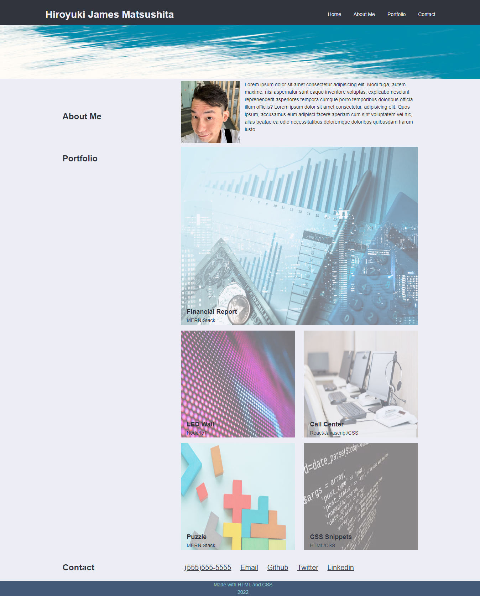

# **about-mitoc-aka-me**

## **Description**

The motivation to create this site was to apply the HTML and CSS that we have learned through these last few weeks.
I believe real application is the best way to learn and grind our skills but the most difficulty I had with the project was using the display:flex properties to align the sections. I cercumvented the issue with the grid properties but in the near future I will come back and apply the flex correctly to achieve the same results. There is no one answer to the many problems that arise so having a flexible and adaptable mind is extremely important.

The plan is to come back to the project to apply more CSS styles and features as I discover them.

## **Features**

- Navigation at the top of the website jumps to the appropriate sections.
- Project images opens a new tab to the project.
- Contact information opens a new tab to relative websites.
- Responsive website to screen sizes.

---
 

### Webpage: [about-mitoc-aka-me](https://lonelymitoc.github.io/about-mitoc-aka-me/)