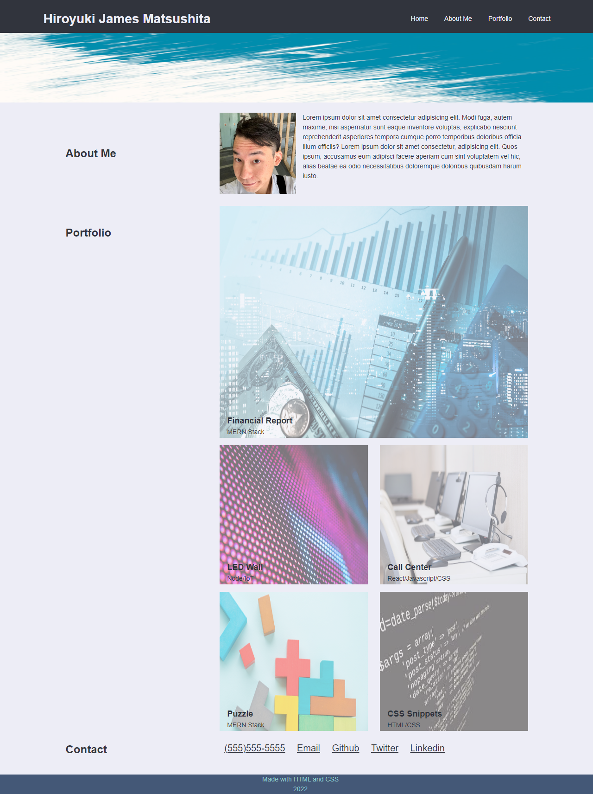

# **about-mitoc-aka-me**

## **Description**

The motivation to create this site was to apply the HTML and CSS that we have learned through these last few weeks.
I believe real application is the best way to learn and grind our skills.
The most difficulty I had with the project was using the display:flex properties to align the sections. I cercumvented the issue with the grid properties but in the near future I will come back and apply the flex correctly to have the same results. There is no one answer to the many problems that arise so having a flexible and adaptable mind is extremely important.

I hope I can come back to the project to apply more CSS styles and features as I discover them.

---

